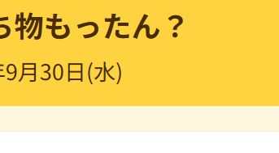

# もったん？

大学に持っていく持ち物や提出課題を、日付ごとに登録・管理できるWebアプリです。
アプリを開くと、その日必要な持ち物だけが自動で画面に表示されます。

**公開URL：** https://mottan-vn1i.vercel.app/

---

## こんな人のためのアプリです

新大学一年生
朝の忙しい通学準備中に、その日必要な持ち物や提出課題をスムーズに確認・整理したい学生

## 解決する困りごと

毎朝の準備の場面で、様々な情報源を見て見落としていないか不安になる気持ちを、持ち物を一目瞭然にすることで解決するアプリ。

---

## 使い方

1. **今日持っていくものを確認する**
   ブラウザでアプリを開きます。画面上部に今日の日付が表示され、その下に「今日必要な持ち物」のみがカード形式で自動表示されます。
2. **新しい持ち物を登録する**
   画面下の「持ち物・課題の名前」に入力し、「日付で登録」または「曜日でくりかえす」を選択して日付を指定後、「追加」ボタンを押すと登録されます。
3. **明日以降の持ち物を確認する**
   「明日以降の持ち物（〇件）」を押すと、これから先に必要なアイテムが日付順で一覧表示されます。
4. **不要になった持ち物を消す**
   登録間違いや不要になった持ち物は、カードを左へスワイプする（PCでは右側の「−」ボタンを押す）ことで簡単に削除できます。
---

## 主な機能

| 機能 | 説明 |
|---|---|
| 今日必要な持ち物の自動抽出 | 保存データの中から今日の日付に一致する持ち物・課題のみを抽出し、メイン画面にわかりやすくカード表示します。 |
| 日付・曜日リピートでの登録 | 単発の日付指定登録に加え、「曜日でくりかえす」設定により毎週必要な持ち物も簡単に登録できます。 |
| 明日以降の持ち物一覧（折りたたみ） | アコーディオン形式で明日以降の持ち物件数と一覧を日付順に確認できます。 |
| 自動データ整理 | 過去の日付（昨日以前）の持ち物は自動で削除され、毎週リピートの持ち物は次回の対象日に自動更新されます。 |
| 直感的な削除操作（ボタン） | 削除ボタンによる簡単な削除が可能です。 |
| データ自動保存 | 登録・削除したデータはブラウザ（localStorage）に自動で保持され、再読み込みしても消えません。 |

## 今回は作らなかった機能

カテゴリ別固定持ち物機能
プッシュ通知・リマインダー機能 
データ共有・ユーザー認証機能
カレンダー表示機能
タグわけ機能

---

## 使っている技術

- HTML / CSS / JavaScript
- localStorage（データの保存）
- 公開：`<Vercel / GitHub Pages>`

外部のライブラリやフレームワークは使っていません。

---

## AI の使い分け

この作品は、集中講義「生成AIエージェントによるWebアプリ開発入門」で、
生成AIを使って開発しました。

| | 使ったAI | 何に使ったか |
|---|---|---|
| 考える・整理する | Gemini |課題の整理、仕様書の下書き、この説明文の下書き、claude codeに送るプロンプトの下書き|
| 実装する・直す | Claude Code | HTML/CSS/JavaScriptの実装、画面の実装、機能の追加、不具合の調査と修正|
| **決める・確かめる** | **人間（私たち）** | 解決する課題の決定、何を作るかの決定、AIの提案の採否、動作検証、公開の判断 |

AI が出した提案のうち、日付の入力表示方法やUIの挙動については私たちの判断で修正・調整を行いました。
最終的な動作確認と公開の判断は、すべてチームのメンバーが行っています。

---

## 開発メンバー

- じゃがいも
- わさび
- ぷりん
- たこやき

## ローカルで動かす方法

このアプリは HTML / CSS / JavaScript だけでできています。
特別な準備は必要ありません。

1. このリポジトリをダウンロード（または `git clone`）します。
2. `index.html` をブラウザで開きます。

> VS Code で開いている場合は、Live Server 拡張を使うと確認が楽です。

---

## 注意

- データはブラウザに保存されます。**別のブラウザや別の端末では引き継がれません。**
- ブラウザの履歴やサイトデータを削除すると、データも消えます。
